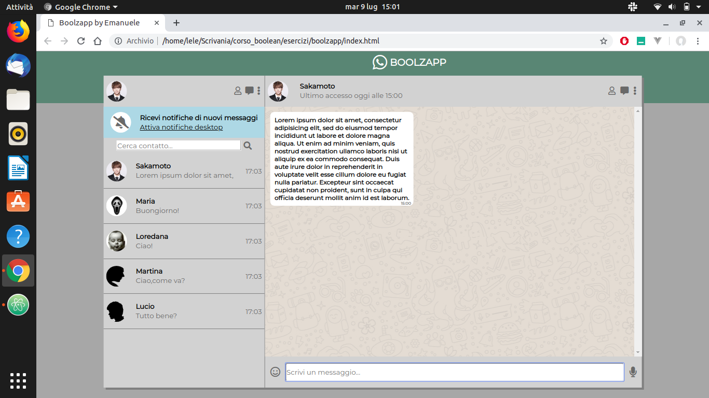
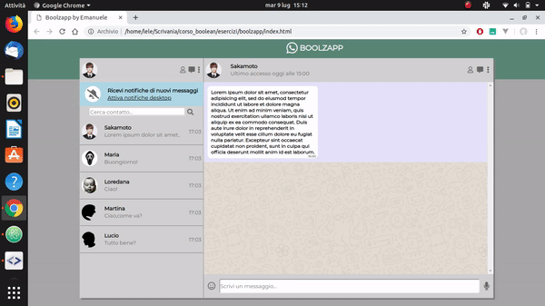
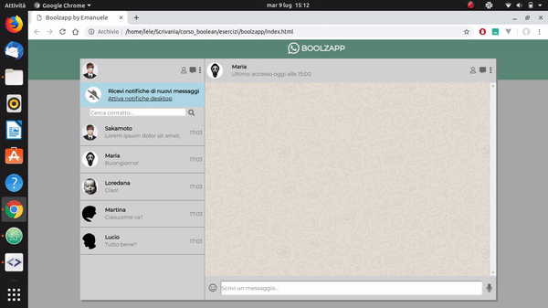

# Boolzapp
Applicazione ispirata alla versione web di [Whatsapp](https://web.whatsapp.com/) che permette l'invio di messaggi ai contatti in rubrica,la cancellazione degli stessi,la ricerca dei contatti all'interno della rubrica.
Dopo l'invio di un messaggio,il sistema genera automaticamente una risposta standard al mittente.
# Tecnologie utilizzate
HTML,CSS,Javascript,jQuery,Handlebars.js
# Screenshots

Invio

Cancellazione e ricerca contatto

